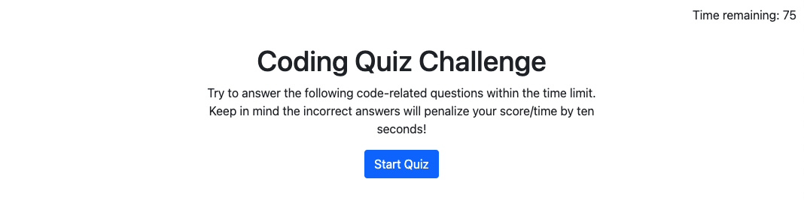
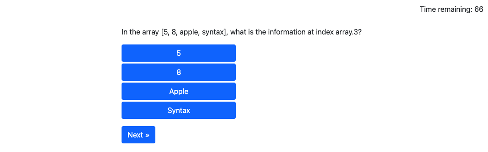

# HW04_quiz

Homework for 04 APIs - create a timed quiz to test coding knowledge

* As a user, I expect to be challenged with questions about coding

* As a user, I want to see how others performed on the same questions

## Expected Behavior

Users should be able to start the quiz, answer questions, be informed if they are correct or incorrect, be penalized for choosing the incorrect answer, and develop a score based on how well they performed and how quickly the finished the quiz.
q
Users should be able to log their scores for others to see.

Users should be able to see scores from previous players.

## Assets

Class, TA's, classmates, friends in the industry and TONS of research.

<!-- insert screen shots here -->
## Stages of the quiz

Greeting, instructions, and START button !!

The quiz questions !!

The results !!

